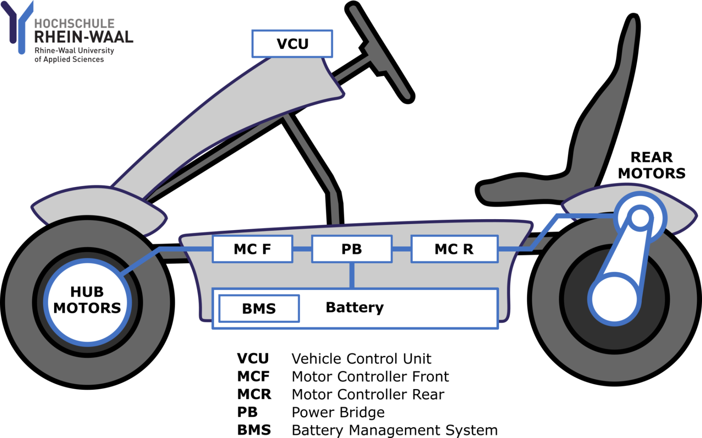
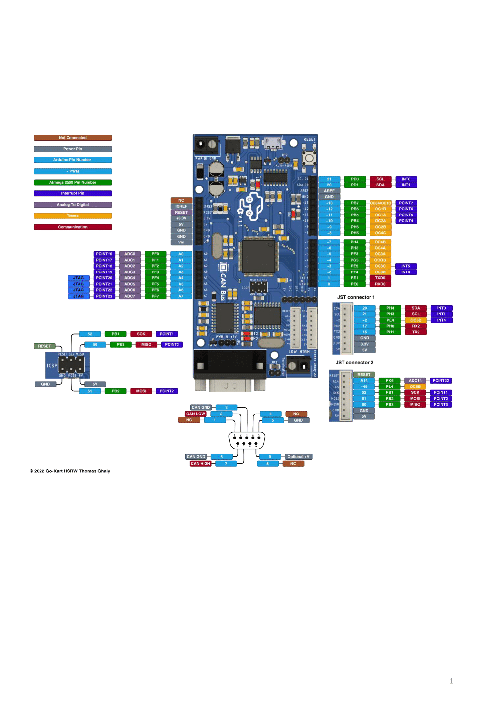

# Go-Kart
This repository is for the HSRW Electrical Go Kart project, aiming to connect various sensors to MicroAutoBox2 and establish a real-time system with CAN communication.

## Control System
The central control unit in the vehicle is a dSpace MicroAutoBox. The real-time system is used to control the communication between all components, receive the driver input, and control the motor torque at each wheel. The system is programmed in block-oriented programming using Matlab/Simulink. It is capable of running code for running the basic functions, as well as complex vehicle simulations and algorithms for control and energy optimization. The modular character of the program code allows for easy change and the extension of implemented functions, which enables the integration of various subsystems on the vehicle. To enhance modularity, two centralized ECUs are used, providing the physical interfaces to various sensors and systems in the vehicle. The SensorBox bundles all incoming sensor signals, like throttle, brake, and steering wheel angle in the basic setup. The HMIBox provides the information, which is displayed for the driver.


## Communication
For communication, CAN-bus is implemented which carries all signals and messages between the components.
- One central bus system prevents extensive wiring of each signal/sensor
- Flexible and quick integration of additional systems
- All Information available on for components
- High data integrity and bus availability
- Reduces complexity and fewer error sources

# External Sensors Integration

In the project, a customized Arduino Mega with MCP2515 CAN controller is utilized for integrating external sensors. Its key advantage lies in seamless integration with the MicroAutoBox2, enabling the addition of various sensors to the system.

Example of main file:


cpp ```
#include "config.h"

void setup() {
  Serial.begin(115200);

}

void loop() {
  pot.conv2bytes();

  //send msg
  CanHandler.Data[0] = pot.msb;
  CanHandler.Data[1] = pot.lsb;
  CanHandler.Data[2] = sonic1.dist();
  CanHandler.Data[3] = sonic2.dist();

  // send data:  ID = 0x100, Standard CAN Frame 0, Data length = 8 bytes, 'data' = array of data bytes to send
  CanHandler.send(0x100, 0, 8);

  delay(50);  // send data per 50ms
}
